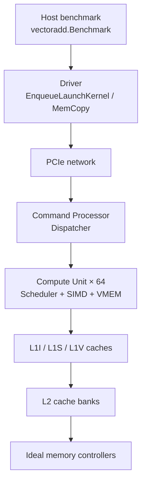

# navisim

NaviSim is a cycle-level simulator for AMD RDNA GPUs. This checkout's sample runner uses the `R9Nano`-named builder with 64 CUs and 32-lane wavefronts. That configuration should not be treated as the calibrated RX 5500 XT model from the paper. This document walks through a simple element-wise GPU kernel, from host launch down to memory controllers.

## Vector Add Walkthrough

This section traces how NaviSim executes a simple element-wise kernel. The sample lives in `samples/vectoradd/` and exercises the full GPU stack: driver → command processor → compute units → caches → ideal memory controllers.

### Run the sample

```bash
go build ./...
cd samples/vectoradd
go run . -timing -verify -report-all -length 4096
```

Expected output:

```
Passed!
```

Useful tracing flags:

| Flag | Effect |
|---|---|
| `-timing` | Build the timing platform using `platform.MakeR9NanoBuilder()` |
| `-verify` | Check host-visible results after `MemCopyD2H` |
| `-report-all` | Write cache/DRAM metrics to `metrics.csv` |
| `-debug-isa` | Dump per-instruction register state to `isa_GPU*.debug`; these files can become large |
| `-trace-vis` | Record component traces for visualization |
| `-trace-mem` | Record memory traffic |

**Measured run** (`length=4096`, `-timing -report-all`):

| Metric | Value |
|---|---|
| Driver kernel time | 5.35 µs |
| GPU1 CP kernel time | 4.76 µs |
| Total simulated time | 16.19 µs |

### OpenCL kernel

The intended operation is a per-element add of a constant:

```opencl
__kernel void VectorAdd(const int count,
                        __global const float* in,
                        __global float* out) {
    int index = get_global_id(0);
    if (index < count)
        out[index] = in[index] + 1.0f;
}
```

Source: `benchmarks/dnn/vectoradd/kernels.cl`.

Launch geometry for this sample: **4096 work-items**, work-group size **64** → **64 work-groups**, each with **2 wavefronts** (32 lanes each).

### Code-object note

NaviSim's loader and timing model expect **legacy HSA code objects (v2)**: a 256-byte `amd_kernel_code_t` header followed by ISA bytes. The checked-in `kernels.hsaco` is a **patched copy of the legacy ReLU object**: its two `v_max_f32` instructions are replaced with `v_add_f32 v2, 1.0, v2` and `v_mov_b32 v2, v2`. The move preserves negative results rather than applying ReLU's clamp. The ELF symbol remains `ReLUForward`; the benchmark deliberately loads that symbol.

The OpenCL source in `kernels.cl` describes the intended operation. Modern ROCm code objects and GCN encodings are not supported by this sample's rebuild path; mixing their opcode tables with the RDNA decoder is not a valid conversion.

### Simulated machine configuration

| Parameter | Value |
|---|---|
| GPU builder | `R9NanoGPUBuilder` (`gpubuilder/r9nano.go`) |
| Shader arrays | 16 |
| CUs per shader array | 4 → **64 CUs total** |
| Wavefront width | 32 lanes (`kernels/gridbuilder.go`) |
| L1V line size | 128 bytes (`log2CacheLineSize = 7`) |
| Page size | 4 KiB (`log2PageSize = 12`) |
| L2 banks | 8 per GPU |
| Memory controller | `idealmemcontroller.Comp` per bank |

Launch geometry for `length=4096`: grid **4096×1×1**, work-group **64×1×1** → **64 work-groups**, each with **2 wavefronts** (32 lanes each). Work-group *i* processes elements `[64i, 64i+63]`.

### End-to-end execution path



### Layer-by-layer trace

#### 1. Host setup (`benchmarks/dnn/vectoradd/vectoradd.go`)

The benchmark fills `input[i] = float32(i)` and expects `output[i] = input[i] + 1`.

| Step | API | What happens |
|---|---|---|
| Allocate | `AllocateMemory` | Buddy allocator reserves device buffers (`gInputData`, `gOutputData`) |
| Upload | `MemCopyH2D` | Driver enqueues `MemCopyH2DCommand` → PCIe → GPU DMA engine writes 16 KiB of floats |
| Launch | `EnqueueLaunchKernel` | Copies code object, kernargs, and AQL packet to GPU; queues `LaunchKernelCommand` |
| Sync | `DrainCommandQueue` | Discrete-event engine runs until CP reports kernel done |
| Download | `MemCopyD2H` | Reads 16 KiB back for `Verify()` |

Kernel arguments (`KernelArgs`):

```go
Count: 4096, Input: gInputData, Output: gOutputData, HiddenGlobalOffsetX: 0
```

#### 2. Driver → GPU (`driver/kernel.go`, `driver/driver.go`)

`EnqueueLaunchKernel` performs three H2D copies then enqueues launch:

1. Code object bytes → `dCoData`
2. `KernelArgs` struct → `dKernArgData`
3. `HsaKernelDispatchPacket` → `dPacket` (grid 4096, WG size 64, kernel object pointer, kernarg pointer)

`processLaunchKernelCommand` sends `LaunchKernelReq` over PCIe to GPU1's command processor (`platform/r9nano.go` builds a 4-GPU platform; this sample uses GPU 1).

#### 3. Command processor (`timing/cp/commandprocessor.go`, `timing/cp/internal/dispatching/dispatcher.go`)

The dispatcher:

1. Calls `alg.StartNewKernel` with the code object and dispatch packet.
2. Iterates work-groups 0…63, assigning each to a CU via round-robin (`MapWGReq`).
3. Tracks completion; when all 64 WGs retire, sends `LaunchKernelRsp` to the driver.

#### 4. Wavefront bring-up (`timing/cu/wfdispatcher.go`)

For each wavefront the dispatcher creates:

```go
wf.PC = pkt.KernelObject + co.KernelCodeEntryByteOffset  // skip 256-byte header
wf.EXEC = 0xffffffff                                  // 32 lanes active
```

The code-object header controls which SGPRs the dispatcher initializes. This kernel uses:

| SGPR slot | Content |
|---|---|
| Dispatch ptr | Address of the AQL packet on GPU (`s[4:5]`) |
| Kernarg ptr | Address of `KernelArgs` on GPU (`s[6:7]`) |
| WG ID X | Work-group index 0…63 (`s8`) |

Per-lane VGPR0 receives the work-item X index (`wfdispatcher.go`): the first wavefront starts at 0 and the second starts at 32 within the work-group. Each executes 32 active lanes.

#### 5. Kernel ISA

The 26-instruction kernel body (after the 256-byte header at file offset `0x1100`):

| # | Instruction | Unit | Role |
|---|---|---|---|
| 0–3 | `s_load_dword`, `s_load_dwordx2`, `s_waitcnt` | Scalar (SMEM) | Read group size, global offset, and count |
| 4–5 | `s_and_b32`, `s_mul_i32` | Scalar | Bounds / stride setup |
| 6–7 | `v_add_nc_u32`, `v_add_co_u32` | SIMD | Per-lane index = WG base + lane ID |
| 8–11 | `s_waitcnt`, `v_cmp_gt`, `s_and_saveexec`, `s_cbranch_execz` | Scalar+SIMD | `if (index < count)` guard |
| 12–15 | `s_load_dwordx4`, `v_mov`, `v_ashrrev_i64`, `s_waitcnt` | Scalar+SIMD | Load buffer bases; form 64-bit addresses |
| 16–19 | `v_add_co_u32`, `v_add_co_ci_u32` | SIMD | `v[2:3]` = input addr, `v[0:1]` = output addr per lane |
| **20** | **`global_load_dword v2, v[2:3], off`** | **VMEM** | **Load `input[i]` into v2** |
| 21 | `s_waitcnt vmcnt(0)` | Scalar | Wait for load |
| **22** | **`v_add_f32_e32 v2, 1.0, v2`** | **SIMD** | **`v2 = v2 + 1.0` — the add** |
| 23 | `v_mov_b32_e32 v2, v2` | SIMD | Preserve the addition result |
| **24** | **`global_store_dword v[0:1], v2, off`** | **VMEM** | **Store result to `output[i]`** |
| 25 | `s_endpgm` | Scalar | Wavefront retire |

#### 6. The add at register level (`-debug-isa`)

With `-debug-isa`, each CU writes `isa_GPU1.SA_XX.CU_YY.debug`. Excerpt from work-group 0, wavefront 0 (`isa_GPU1.SA_00.CU_00.debug`):

**After load** (the debugger records completed instructions; addresses vary with allocations):

```
Inst: global_load_dword v2, v[2:3], off
SGPR s0: 0x00001000    ; input buffer base (high half s1 = 0)
SGPR s2: 0x00005000    ; output buffer base (high half s3 = 0)
VGPR v0: 0x5000, 0x5004, 0x5008, …   ; output addresses
VGPR v2: 0x00000000, 0x3f800000, 0x40000000, …   ; input values 0, 1, 2, …
```

**After `v_add_f32_e32 v2, 1.0, v2`** — lane *k* holds `float32(k) + 1.0`:

```
VGPR v2: 0x3f800000  0x40000000  0x40400000  …
         (= 1.0)      (= 2.0)      (= 3.0)
```

`0x3f800000` is IEEE-754 `1.0f`; `0x40000000` is `2.0f`. This matches `input[0]=0+1` and `input[1]=1+1`.

**After store** — `global_store_dword` writes those values to `output[i]` at addresses in `v[0:1]` (base `0x5000` + 4×lane in this run).

#### 7. Compute-unit pipeline (`timing/cu/computeunit.go`)

Each simulated cycle, a CU advances its sub-units:

| Stage | Component | File |
|---|---|---|
| Fetch | Scheduler fetches from L1I | `timing/cu/scheduler.go` |
| Decode | Per-pipe decode units | `timing/cu/decodeunit.go` |
| Issue | Arbiter selects ready wavefronts | `timing/cu/issuearbiter.go` |
| Execute | Scalar unit, SIMD unit, VMEM unit | `timing/cu/scalarunit.go`, `simdunit.go`, `vectormemoryunit.go` |
| Writeback | Scratchpad preparer commits to regfile | `timing/cu/scratchpadpreparer.go` |

Instruction routing by execution unit (`rdnainsts/decodetable.go`):

- `s_load_*` → **Scalar unit** (SMEM path through L1S)
- `v_add_f32` → **SIMD unit** (32 SP lanes/cycle → 1 cycle for 32 lanes in `SIMDUnit`)
- `global_load/store` → **Vector memory unit** (FLAT format, opcodes 12/28)

#### 8. Vector memory and coalescing (`timing/cu/vectormemoryunit.go`, `timing/cu/defaultcoalescer.go`)

When `global_load_dword` reaches the VMEM unit:

1. **Prepare** — `scratchpadPreparer` reads per-lane addresses into the flat scratchpad.
2. **Coalesce** — `defaultCoalescer` merges lanes hitting the same 128-byte line into one `ReadReq`.
3. **Send** — request leaves `cu.ToVectorMem` through the reorder buffer and address translator to L1V.

For each wavefront's 32 consecutive floats, the coalescer produces **1 L1V read request** (32 lanes × 4 B = 128 B per line). WG 0's two wavefronts therefore issue two reads in total. The store path mirrors this with `WriteReq`.

`s_waitcnt vmcnt(0)` holds the wavefront until outstanding vector loads complete; the scheduler checks `wf.OutstandingVectorMemAccess`.

#### 9. Memory hierarchy to DRAM (`gpubuilder/r9nano.go`)

Address path for each L1V miss:

```
CU VMEM port → reorder buffer → address translator → L1V → L2 bank → ideal memory controller
                                      ↓
                                L1 TLB → L2 TLB → MMU (4 KiB pages)
```

**Measured metrics** (`metrics.csv`, 4096-element timing run):

| Metric | Value |
|---|---|
| Driver kernel time | 5.35 µs |
| GPU1 CP kernel time | 4.76 µs |
| Total simulated time | 16.19 µs |
| L1V req latency (per bank) | ~60–215 ns |
| L2 read-miss (e.g. `GPU1.L2_5`) | 32 |
| L2 write-miss (e.g. `GPU1.L2_5`) | 32 |

Cache counters depend on the selected workload and configuration; inspect the generated `metrics.csv` when comparing runs.

#### 10. Completion

1. Each wavefront hits `s_endpgm`; the scheduler marks it complete.
2. CU sends `WGCompletionRsp` to the CP dispatcher.
3. After 64/64 work-groups complete, CP responds to the driver.
4. `DrainCommandQueue` returns; host `MemCopyD2H` reads `output[i] = float32(i) + 1`.
5. `Verify()` checks all 4096 elements → `Passed!`

### Files added for this walkthrough

| Path | Purpose |
|---|---|
| `benchmarks/dnn/vectoradd/kernels.cl` | OpenCL vector-add kernel source |
| `benchmarks/dnn/vectoradd/vectoradd.go` | Benchmark implementing the HSA launch protocol |
| `benchmarks/dnn/vectoradd/patch_from_relu.sh` | Regenerate patched `kernels.hsaco` from ReLU |
| `samples/vectoradd/main.go` | CLI entry point using `samples/runner` |

### Rebuilding the kernel (optional)

The patch preserves the `global_load` / `global_store` encoding that NaviSim's timing model supports. It checks the source ReLU object's SHA-256 before changing fixed instruction offsets, then embeds the resulting binary with a fixed modification time.

Install `esc` if needed, then regenerate the checked-in artifacts with Go, Python 3, and `esc` on your PATH:

```bash
go install github.com/mjibson/esc@v0.2.0
cd benchmarks/dnn/vectoradd
make regenerate   # produces kernels.hsaco + esc.go
```

Run `make` to update artifacts when their inputs change. No ROCm installation or temporary compiler paths are needed. The source `kernels.cl` is provided for reference; this recipe patches the existing legacy binary instead of compiling it.

## Simulation Validation

The [bundled PACT 2022 paper](<PAPER/NaviSim: A Highly Accurate GPU Simulator for AMD RDNA GPUs.pdf>) validates NaviSim against RX 5500 XT hardware and reports a 9.75% average execution-time error. Its validation suite and configuration differ from this checkout's default sample platform.

### Repository samples (not all in the paper table)

NaviSim ships **20+ runnable samples** under `samples/`. They fall into three groups:

| Group | Examples | Purpose |
|---|---|---|
| **Getting started** | **Vector Add** (`samples/vectoradd`), MemCopy | Minimal kernels to learn the simulator; not in the PACT paper |
| **Paper validation** | FIR, ReLU, ATAX, BICG, FWT, KM, MT, SPMV, BS, FW | Compared against RX 5500 XT results in the table below |
| **Extra workloads** | BFS, FFT, N-body, AES, MM, convolution, … | Additional benchmarks and multi-kernel tests |

**Vector Add** is the recommended first run—a single element-wise kernel (`out[i] = in[i] + 1.0f`) that exercises the full stack. See [Vector Add Walkthrough](#vector-add-walkthrough) above. It is intentionally simple and is **not** part of the PACT hardware comparison (the paper did not report a vector-add benchmark).

```bash
cd samples/vectoradd && go run . -timing -verify -length 4096
```

### Historical local timing notes

These values were recorded in the earlier local README draft. The full suite has not been rerun for this cleanup, and exact commands and raw results are not checked in. Treat them as historical notes, not a reproduction of the paper's accuracy validation.

| Benchmark | Problem Size | Local Sim (µs) | Estimated Paper HW (µs) | Paper Average Error (%) |
|---|---|---|---|---|
| FIR | 1M | 278.3 | ~220 | 12.9 |
| ReLU | 1M | 98.5 | ~96 | 3.1 |
| ATAX | 2K | 1433.9 | ~1205 | 7.9 |
| BICG | 2K | 1428.3 | ~1322 | 5.9 |
| FWT | 64K | 116.8 | ~97 | 5.5 |
| KM | 256 | 166.2 | ~135 | 11.5 |
| MT | 256 | 12.3 | ~10.5 | 13.5 |
| SPMV | 1200 | 16.9 | ~14 | 9.8 |
| BS | 4K | *timeout* | — | 3.9 |
| FW | 64 | *timeout* | — | 19.0 |

The hardware times were estimated visually from Figure 6. The paper's error percentages are averages across multiple problem sizes, so they cannot be directly compared to errors computed from a single estimated point. The local platform also differs from the paper's calibrated RX 5500 XT configuration.

### Build and verification commands

1.  **Build:** `go build ./...`
2.  **Test:** `go test ./...`
3.  **Quick start:** `cd samples/vectoradd && go run . -timing -verify -length 4096`
4.  **Example larger workload:** `cd samples/fir && go run . -timing -verify -report-all -length 1000000`

The MGPUSim v2 BFS source under `navi_validation/bfs/` is retained for reference and excluded with build tags because it uses a different driver and kernel API. The runnable NaviSim BFS sample is under `samples/bfs/`.

### Interpreting timings

The host CPU affects the wall-clock time required to run a simulation. The CSV's kernel and total times describe simulated execution, rather than how long the Go process ran. Use the same kernel object, launch geometry, platform configuration, and metric when comparing simulated times.

The historical draft recorded 30-minute wall-clock timeouts for Bitonic Sort and Floyd-Warshall. Those records do not establish the cause of the timeouts. The paper discusses launch-overhead modeling limits for FW and KM, but that observation alone does not explain these local runs.

`samples/runner/metrics.go` now closes the CSV after writing its header and metric rows. The previous premature close produced empty files; a regression test checks the written contents.
